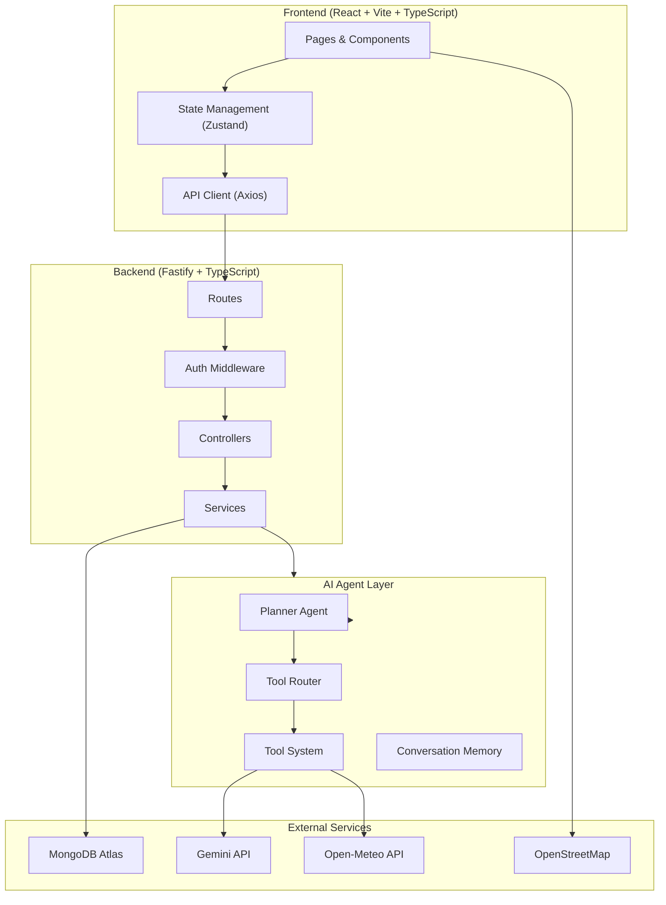

# CitySphere 2.0 — AI-Powered Smart City Digital Twin

## Current State

The existing project at `c:\CitySphere\CitySphere` is a **static HTML/CSS/JS frontend-only demo** with:
- 5 HTML pages (dashboard, transport, events, map, budget)
- Mock data hardcoded in `main.js`
- GSAP animations, Tailwind CDN, Leaflet maps
- No React, no TypeScript, no backend, no database, no AI

**This is a complete rewrite** — we will build a production-grade full-stack application from scratch inside the same repository, preserving the existing `frontend/` folder as a reference for Delhi location data and design inspiration.

---

## User Review Required

> [!IMPORTANT]
> **Gemini API Key Required**: You'll need a Gemini API key (free tier available at [aistudio.google.com](https://aistudio.google.com)). The AI Assistant (Phase 4+) depends on this.

> [!IMPORTANT]
> **MongoDB Atlas**: You'll need a free MongoDB Atlas cluster. We'll provide setup instructions, but the connection string must be supplied before the backend can run.

> [!WARNING]
> **Scope**: This is a massive 12-phase project. I will build each phase completely before moving to the next, as requested. The full build will take significant time. I recommend we proceed phase-by-phase with check-ins.

---

## Open Questions

> [!IMPORTANT]
> **Tailwind CSS version**: You specified Tailwind CSS. Should I use **Tailwind v4** (latest, CSS-first config) or **Tailwind v3** (stable, JS config)? I'll default to **v3** since shadcn/ui has better v3 support.

> [!IMPORTANT]
> **shadcn/ui**: This requires specific setup with Tailwind. I'll use the latest `shadcn/ui` with Radix primitives. Confirmed?

> [!IMPORTANT]
> **City scope**: The existing demo focuses on **Delhi**. Should CitySphere 2.0 remain Delhi-focused, or should it support multiple cities? I'll default to **Delhi-first with multi-city architecture**.

> [!IMPORTANT]
> **Authentication flow**: Should we implement email/password signup, or also Google OAuth? I'll default to **email/password with JWT** as specified.

---

## Architecture Overview



---

## Project Structure

```
CitySphere/
├── frontend/                    # (existing — preserved as reference)
├── client/                      # NEW: React + Vite + TypeScript frontend
│   ├── src/
│   │   ├── assets/
│   │   ├── components/
│   │   │   ├── ui/              # shadcn/ui components
│   │   │   ├── layout/          # Sidebar, Navbar, Footer
│   │   │   ├── dashboard/       # Dashboard widgets
│   │   │   ├── transport/       # Transport planner components
│   │   │   ├── events/          # Event cards, filters
│   │   │   ├── map/             # Leaflet map components
│   │   │   ├── budget/          # Budget charts, sliders
│   │   │   ├── civic/           # Issue reporting components
│   │   │   └── chat/            # AI Assistant chat UI
│   │   ├── hooks/               # Custom React hooks
│   │   ├── lib/                 # Utilities, API client
│   │   ├── pages/               # Page components
│   │   ├── store/               # Zustand state management
│   │   ├── types/               # TypeScript interfaces
│   │   ├── styles/              # Global CSS, Tailwind config
│   │   ├── App.tsx
│   │   └── main.tsx
│   ├── index.html
│   ├── tailwind.config.ts
│   ├── tsconfig.json
│   ├── vite.config.ts
│   └── package.json
│
├── server/                      # NEW: Fastify + TypeScript backend
│   ├── src/
│   │   ├── routes/
│   │   │   ├── auth.ts
│   │   │   ├── chat.ts
│   │   │   ├── complaints.ts
│   │   │   ├── events.ts
│   │   │   ├── budget.ts
│   │   │   └── transport.ts
│   │   ├── controllers/
│   │   ├── services/
│   │   │   ├── ai/
│   │   │   │   ├── agent.ts         # Main AI agent
│   │   │   │   ├── planner.ts       # Planner agent
│   │   │   │   ├── memory.ts        # Conversation memory
│   │   │   │   └── tools/
│   │   │   │       ├── registry.ts  # Tool registration
│   │   │   │       ├── weather.ts
│   │   │   │       ├── events.ts
│   │   │   │       ├── budget.ts
│   │   │   │       ├── transport.ts
│   │   │   │       ├── complaint.ts
│   │   │   │       └── map.ts
│   │   │   ├── weather.ts
│   │   │   └── auth.ts
│   │   ├── models/
│   │   │   ├── User.ts
│   │   │   ├── Chat.ts
│   │   │   ├── Complaint.ts
│   │   │   ├── Event.ts
│   │   │   ├── Preference.ts
│   │   │   └── Budget.ts
│   │   ├── middleware/
│   │   │   ├── auth.ts
│   │   │   └── validation.ts
│   │   ├── utils/
│   │   ├── config/
│   │   │   └── index.ts
│   │   └── app.ts
│   ├── tsconfig.json
│   └── package.json
│
├── README.md
└── DEPLOYMENT.md
```

---

## Proposed Changes — Phase by Phase

---

### Phase 1: Frontend Foundation

**Goal**: Set up React + Vite + TypeScript + Tailwind + shadcn/ui with all pages, layout, and design system.

#### [NEW] `client/` — Full React application

**Setup**:
- `npx create-vite@latest ./ --template react-ts`
- Install: `tailwindcss`, `postcss`, `autoprefixer`, `@radix-ui/*`, shadcn/ui
- Install: `react-router-dom`, `framer-motion`, `zustand`, `axios`
- Install: `react-leaflet`, `leaflet`, `chart.js`, `react-chartjs-2`

**Pages** (7 total):
1. **Dashboard** (`/`) — Hero section, live city widgets (weather, AQI, metro countdown, traffic, crowd predictor, local essentials)
2. **Transport Planner** (`/transport`) — Route search with origin/destination, multi-modal results (metro, bus, walking, cab)
3. **City Events** (`/events`) — Filterable event grid with categories, featured events, event details
4. **Interactive Map** (`/map`) — Full-screen Leaflet map with category filters, layer toggles, location markers
5. **Civic Reports** (`/civic`) — Issue reporting form, complaint history, status tracking
6. **Budget Planner** (`/budget`) — Expense sliders, Chart.js pie/bar charts, AI savings tips
7. **AI Assistant** (`/assistant`) — Full-page chat interface with markdown rendering, typing indicators

**Design System**:
- Glassmorphism cards with `backdrop-filter: blur()`
- Dark/Light theme via CSS variables + Tailwind dark mode
- Gradient text, neon accents in dark mode
- Framer Motion page transitions and micro-animations
- Inter + Outfit fonts from Google Fonts
- Responsive: Desktop sidebar → Mobile bottom nav

**Key Components**:
- `AppSidebar` — Collapsible sidebar navigation with icons
- `ThemeToggle` — Dark/light switch with animation
- `GlassCard` — Reusable glassmorphism container
- `StatWidget` — Dashboard stat card with animated counter
- `WeatherWidget` — Live weather display
- `CrowdCard` — Crowd level indicator with pulse animation
- `EventCard` — Event listing card with hover effects
- `ChatMessage` — AI chat message bubble
- `ChatInput` — Message input with send button

---

### Phase 2: Backend Foundation

**Goal**: Production-ready Fastify API with TypeScript, JWT auth, modular architecture.

#### [NEW] `server/` — Fastify backend

**Setup**:
- `npm init -y`
- Install: `fastify`, `@fastify/cors`, `@fastify/jwt`, `@fastify/multipart`
- Install: `mongoose`, `bcryptjs`, `zod`
- Install: `typescript`, `tsx`, `@types/node`

**Routes**:
- `POST /api/auth/register` — User registration
- `POST /api/auth/login` — JWT login
- `GET /api/auth/me` — Get current user
- `POST /api/chat` — Send message to AI assistant
- `GET /api/chat/history` — Get conversation history
- `POST /api/complaints` — File civic complaint
- `GET /api/complaints` — List user's complaints
- `GET /api/events` — List city events
- `POST /api/budget` — Save budget data
- `GET /api/budget` — Get budget analysis
- `GET /api/weather` — Proxy to Open-Meteo API
- `POST /api/transport/route` — Get route recommendations

**Middleware**:
- JWT authentication guard
- Request validation via Zod schemas
- Error handling with proper HTTP codes
- Rate limiting for AI endpoints

---

### Phase 3: Database Design

**Goal**: Optimized MongoDB schemas with proper indexing.

#### [NEW] `server/src/models/` — Mongoose models

| Collection | Key Fields | Indexes |
|---|---|---|
| **Users** | email, password (hashed), name, preferences, createdAt | `email` (unique) |
| **Chats** | userId, messages[], summary, createdAt | `userId`, `createdAt` |
| **Complaints** | userId, category, description, location (GeoJSON), images[], status, upvotes | `userId`, `status`, `location` (2dsphere) |
| **Events** | title, description, category, date, location, price, featured | `category`, `date`, `featured` |
| **Preferences** | userId, preferredTransport, budgetRange, favoriteLocations[], searchHistory[] | `userId` (unique) |
| **Budgets** | userId, month, entries[], totalIncome, totalExpense | `userId`, `month` |

---

### Phase 4: AI Assistant

**Goal**: Gemini-powered conversational AI with tool calling.

#### [NEW] `server/src/services/ai/agent.ts`

**Architecture**:
- Uses `@google/generative-ai` SDK
- System prompt defines CitySphere's persona as a smart city assistant
- Supports Gemini function calling (tool use)
- Maintains conversation context via MongoDB Chat model
- Streams responses back to the frontend

**Capabilities**:
- Route planning: "How to get from KIET to Anand Vihar?"
- Budget analysis: "Optimize my monthly expenses"
- Event discovery: "What's happening this weekend under ₹500?"
- Weather queries: "Will it rain tomorrow?"
- Civic assistance: "Report a pothole near my location"
- General city info: "Best restaurants in Chandni Chowk"

---

### Phase 5: Tool System

**Goal**: Modular tool-calling framework for the AI agent.

#### [NEW] `server/src/services/ai/tools/`

Each tool follows a standard interface:

```typescript
interface Tool {
  name: string;
  description: string;
  parameters: JSONSchema;
  execute(params: any, userId: string): Promise<ToolResult>;
}
```

**Tools**:

| Tool | Function | Data Source |
|---|---|---|
| `weather_tool` | Current weather, forecast, AQI | Open-Meteo API |
| `events_tool` | Search/filter city events | MongoDB Events |
| `budget_tool` | Analyze expenses, suggest savings | MongoDB Budgets |
| `transport_tool` | Route planning with multi-modal options | OpenStreetMap + hardcoded metro/bus data |
| `complaint_tool` | File/track civic complaints | MongoDB Complaints |
| `map_tool` | Find nearby places by category | MongoDB + Delhi location data |

**Tool Router** (`registry.ts`):
- Dynamic tool registration
- Gemini function declaration format
- Tool execution with error handling and logging

---

### Phase 6: Personalized Memory

**Goal**: Remember user preferences across sessions.

#### [MODIFY] `server/src/services/ai/memory.ts`
#### [MODIFY] `server/src/models/Preference.ts`

**Implementation**:
- Store user preferences in MongoDB (`Preference` model)
- Auto-extract preferences from conversations (e.g., "I usually take the metro" → `preferredTransport: "metro"`)
- Inject user context into AI system prompt
- Conversation summaries for long-term memory
- Search history tracking for personalization

---

### Phase 7: Smart Route Planner

**Goal**: AI-powered multi-modal route recommendations.

#### [NEW] `server/src/services/transport.ts`
#### [MODIFY] `client/src/pages/TransportPage.tsx`

**Route Types**:
- 🚇 **Metro**: Delhi Metro route data with line info, interchange stations
- 🚌 **Bus**: DTC bus routes with approximate timings
- 🚶 **Walking**: Distance-based time estimation
- 🚕 **Cab**: Cost estimation using distance × rate

**Output for each route**:
- Estimated time
- Estimated cost
- Step-by-step directions
- AI recommendation (fastest / cheapest / balanced)

**Data**: Hardcoded Delhi metro station graph + distance-based calculations for other modes.

---

### Phase 8: Civic Reporting

**Goal**: AI-assisted complaint system with image upload.

#### [NEW] `client/src/pages/CivicPage.tsx`
#### [MODIFY] `server/src/routes/complaints.ts`

**Features**:
- Issue form with category selection (Pothole, Garbage, Streetlight, Water Leakage)
- Image upload via `@fastify/multipart` (stored as base64 or file path)
- AI auto-classification of issue type from description
- Location tagging via browser geolocation
- Auto-generated complaint ID
- Complaint history with status tracking
- Upvote system

---

### Phase 9: Events Intelligence

**Goal**: AI-powered event discovery and recommendations.

#### [MODIFY] `client/src/pages/EventsPage.tsx`
#### [MODIFY] `server/src/services/ai/tools/events.ts`

**Features**:
- Event categorization: Food, Music, Art, Sports, Workshop, Festival, Theater
- AI recommendations based on user preferences, budget, and location
- "What should I do this evening under ₹500?" queries
- Event search with filters (date, category, price range, location)
- Personalized "For You" section

---

### Phase 10: Budget Intelligence

**Goal**: AI-powered expense tracking and optimization.

#### [MODIFY] `client/src/pages/BudgetPage.tsx`
#### [MODIFY] `server/src/services/ai/tools/budget.ts`

**Features**:
- Monthly expense entry (rent, food, commute, utilities, entertainment)
- Chart.js visualizations (pie chart, bar chart, trend line)
- AI analysis: "You're spending 40% on food — here are ways to optimize"
- Transport cost optimization suggestions
- Savings goal tracking
- Budget comparison across months

---

### Phase 11: Digital Twin

**Goal**: Interactive city visualization with data layers.

#### [MODIFY] `client/src/pages/MapPage.tsx`

**Layers** (toggleable):
- 🏛️ **Landmarks** — Delhi monuments and points of interest
- 🚦 **Traffic** — Simulated traffic density heatmap
- 👥 **Crowd** — Crowd level indicators at popular locations
- 🎪 **Events** — Upcoming event locations on map
- ⚠️ **Civic Issues** — Reported complaints with status markers
- 🚇 **Metro** — Metro stations with line colors

**Implementation**:
- React-Leaflet with custom tile layers
- Layer toggle controls
- Animated markers with Framer Motion
- Popup cards with location details
- "My Location" button with geolocation

---

### Phase 12: Multi-Agent System

**Goal**: Specialized agents coordinated by a planner.

#### [NEW] `server/src/services/ai/agents/`

**Agents**:

| Agent | Responsibility | Tools |
|---|---|---|
| **Planner Agent** | Decomposes user queries, delegates to specialists | All tools (read-only) |
| **Route Agent** | Transport planning and route optimization | `transport_tool`, `map_tool`, `weather_tool` |
| **Budget Agent** | Financial analysis and recommendations | `budget_tool` |
| **Events Agent** | Event discovery and recommendations | `events_tool`, `weather_tool` |
| **Complaint Agent** | Civic issue handling | `complaint_tool`, `map_tool` |

**Architecture**:
- Planner receives user message, classifies intent
- Delegates to the appropriate specialist agent
- Specialist uses its tools and returns structured output
- Planner synthesizes final response
- All agents share conversation memory

**Implementation**: Each agent is a separate Gemini call with a specialized system prompt and restricted tool set. The Planner agent orchestrates using a simple intent classification approach.

---

## Execution Strategy

Given the massive scope, I'll execute in this order:

| Order | Phase | Dependency | Estimated Files |
|---|---|---|---|
| 1 | Phase 1: Frontend Foundation | None | ~40 files |
| 2 | Phase 2: Backend Foundation | None (parallel-ready) | ~20 files |
| 3 | Phase 3: Database Design | Phase 2 | ~8 files |
| 4 | Phase 4: AI Assistant | Phase 2, 3 | ~5 files |
| 5 | Phase 5: Tool System | Phase 4 | ~8 files |
| 6 | Phase 6: Memory | Phase 4, 5 | ~3 files |
| 7 | Phase 7: Route Planner | Phase 5 | ~3 files |
| 8 | Phase 8: Civic Reporting | Phase 2, 3 | ~4 files |
| 9 | Phase 9: Events Intelligence | Phase 5 | ~3 files |
| 10 | Phase 10: Budget Intelligence | Phase 5 | ~3 files |
| 11 | Phase 11: Digital Twin | Phase 1 | ~3 files |
| 12 | Phase 12: Multi-Agent | Phase 4, 5 | ~6 files |

**Total**: ~100+ files across frontend and backend.

---

## Verification Plan

### Automated Tests
- `npm run build` — TypeScript compilation check (both client and server)
- `npm run dev` — Dev server runs without errors
- API endpoint testing via curl/fetch for all routes

### Manual Verification
- Frontend renders all 7 pages correctly
- Dark/light theme toggle works
- Leaflet map loads with markers
- Chart.js renders in budget page
- Framer Motion animations play smoothly
- AI chat sends/receives messages (requires Gemini API key)
- Complaint form submits and saves to MongoDB
- Auth flow (register → login → protected routes)

### Browser Testing
- Responsive layout on desktop and mobile viewports
- Navigation between all pages
- Interactive elements (sliders, filters, chat input)
